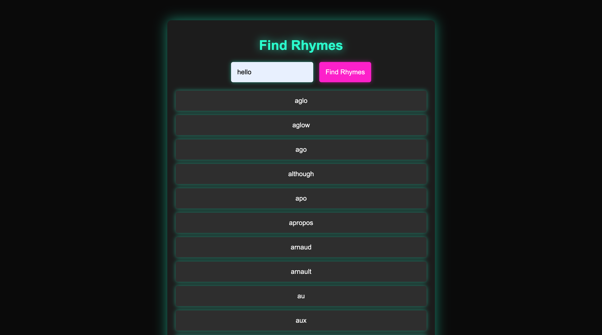

# Rhyme Finder

## Overview

Rhyme Finder is a fun and interactive web application designed for aspiring rappers, poets, and anyone who enjoys crafting catchy rhymes. Whether you're trying to impress your significant other with a sweet rhyme or just want to enhance your lyrical skills, this tool helps you find words that rhyme effortlessly.

## Screenshots tutorial

### 1. open the app


### 2. type your word


### 3. get ryhmes list



## Features

- **User-Friendly Interface**: A simple and intuitive interface for easy interaction.
- **Real-Time Rhyme Suggestions**: Enter a word and get a list of rhymes instantly.
- **Responsive Design**: Works well on various devices, including smartphones and tablets.
- **Dark Theme with Neon Colors**: A visually appealing dark theme for a modern look.

## Tech Stack

- **Backend**: FastAPI - A modern, fast (high-performance) web framework for building APIs with Python.
- **Frontend**: HTML, CSS, JavaScript - For a dynamic and responsive user experience.
- **Rhyme Detection**: Pronouncing - A Python library for phonetic pronunciations to find rhymes.

## Installation

To run Rhyme Finder locally, follow these steps:

1. **Clone the Repository**:

   ```bash
   git clone https://github.com/yourusername/rhyme-finder.git
   cd rhyme-finder
   ```

2. **Set Up a Virtual Environment (optional but recommended):**:

   ```bash
   python -m venv venv
   source venv/bin/activate  # On Windows use `venv\Scripts\activate`
   ```

3. **Install the Required Packages:**:

   ```bash
   pip install fastapi uvicorn pronouncing
   ```

# Running the Application

**After installation, you can run the application using the following command:**

```bash
    uvicorn app:app --reload

```

# Contact Me ;)

- Gmail ---> Rezasepehrs33@gmail.com
- Telegram_ID --> @MRezaSepehr
